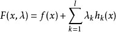
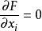
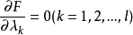

# 机器学习相关数学知识  

## 拉格朗日乘子法  
基本的拉格朗日乘子法就是求函数f(x1,x2,...)在约束条件g(x1,x2,...)=0下的极值的方法。
定义：
对于具有l个等式约束的n维优化问题
min  f(x1,x2,...,xn),
s.t. hk(x1,x3,...,xn) (k=1,2,...,l)
把原目标函数  改造成为如下形式的新的目标函数
   
式中的hk(x)就是原目标函数f(x)的等式约束条件，而待定系数λk称为拉格朗日乘子。这种方法称为拉格朗日乘子法。
在极值点处，有   
  
   
共有n+l(注意，这里是字母小写L，不是数字)个方程，足以算出这n+l个变量，此法也称为升维法。