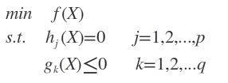
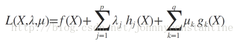
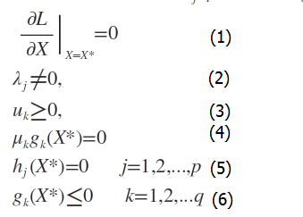

# 机器学习相关数学知识  

## 拉格朗日乘子法  
基本的拉格朗日乘子法就是求函数f(x1,x2,...)在约束条件g(x1,x2,...)=0下的极值的方法。
定义：
对于具有l个等式约束的n维优化问题
min  f(x1,x2,...,xn),
s.t. hk(x1,x3,...,xn) (k=1,2,...,l)
把原目标函数  改造成为如下形式的新的目标函数
   
式中的hk(x)就是原目标函数f(x)的等式约束条件，而待定系数λk称为拉格朗日乘子。这种方法称为拉格朗日乘子法。
在极值点处，有   
  
   
共有n+l(注意，这里是字母小写L，不是数字)个方程，足以算出这n+l个变量，此法也称为升维法。   

[参考](https://baike.baidu.com/item/%E6%8B%89%E6%A0%BC%E6%9C%97%E6%97%A5%E4%B9%98%E5%AD%90%E6%B3%95/1946079?fr=aladdin)  

## KKT条件  
拉格朗日乘子法，解决不等式约束问题的条件。  
不等式约束优化问题描述如下：  
  
对应的拉格朗日函数为：  
   
求解上式必须满足如下条件，即KKT条件：  
   

[参考](https://blog.csdn.net/johnnyconstantine/article/details/46335763)  

## 半正定矩阵  
一个nxn的实对称矩阵，如果对任何非零向量X，都有X'AX≥0，其中X'表示X的转置，就称A为半正定矩阵

## SVM为什么要转化为对偶问题？  
1.  对偶问题将原始问题中的约束转为了对偶问题中的等式约束  
2.  方便核函数的引入  
3.  改变了问题的复杂度。由求特征向量w转化为求比例系数a，在原始问题下，求解的复杂度与样本的维度有关，即w的维度。在对偶问题下，只与样本数量有关。  
[参考](https://www.cnblogs.com/crackpotisback/p/8674534.html)