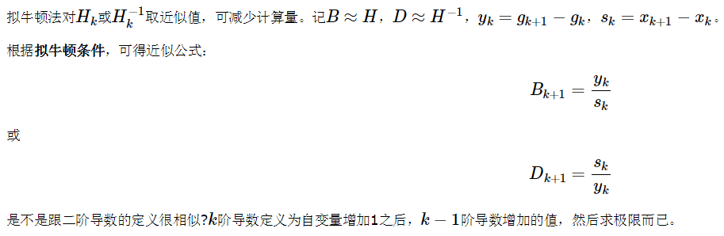

1. 牛顿法  
    [参考](https://blog.csdn.net/itplus/article/details/21897715)
2. 拟牛顿条件
3. DFP 算法
4. BFGS 算法
5. L-BFGS 算法  
6. cnn做卷积的运算时间复杂度,空间复杂度  
    K=核大小，N=输入图片长宽  
    输出图像大小M=(N - K + 2padding)/stride + 1   
    时间复杂度=O(M^2\*K^2\*C_in\*C_out)   
    空间复杂度=O(K^2\*C_in\*C_out)  
    [参考](https://blog.csdn.net/laolu1573/article/details/79196160)
7. Random forest(RF)描述   
    1）从样本集中有放回随机采样选出n个样本；   
    2）从所有特征中随机选择k个特征，对选出的样本利用这些特征建立决策树（一般是CART，也可是别的或混合）；   
    3）重复以上两步m次，即生成m棵决策树，形成随机森林；  
    4）对于新数据，经过每棵树决策，最后投票确认分到哪一类。   
    [参考](https://blog.csdn.net/y0367/article/details/51501780)
8. GBDT描述   
    boosting算法，通过梯度值训练决策树回归树，结果相加得到最终结果。  
    boosting要求基分类器是弱分类器，gbdt采用CART决策树  
    回归树：每个节点的值是该叶子节点中所有元素的平均值  
    gbdt损失函数：回归问题一般采用MSE(最小均方误差)，对应导数是(y - f(x))，对应初始化值为平均值  
                 二分类问题采用logstic损失，-(ylogp + (1-y)log(1-p))，对应初始化值为0.5log(正样本数/负样本数)  
    gbdt算法过程(回归)：  
        1. 初始化F0(x) = 所有样本结果值的平均值
        2. For m from 1 to M:  #  迭代M轮，即学习M棵树
        3.   计算每个样本x损失函数对F<m-1>(x)的导数,导数值作为该棵树学习的目标值  
        4.   通过最优划分，生成决策树，最小化均方误差   
        5.   F<m>(x) = F<m-1>(x) + learn_rate * x在当前决策树中的值  
    [参考](https://www.jianshu.com/p/005a4e6ac775)  
    [参考2](https://www.cnblogs.com/ModifyRong/p/7744987.html) 这一篇概念讲的可以，但是里面的伪代码不是很规范，例子介绍我也没完全看懂   
    [这篇讲的最好](https://blog.csdn.net/qq_22238533/article/details/79185969)
9. LSTM结构推导，为什么比RNN好？  
       
    **修正图片错误：**图上最后a<t>=gate_o\*tanh(c<t>)  图上最后少了一个tanh   
    更新门，遗忘门，输出门  
    通过记忆单元，使得LSTM可以处理长依赖，解决了梯度消失问题。  
10. 梯度消失爆炸为什么？
    由于反向传播和链式法则。当网络层数增大时，多个导数相乘，导数大于1时发生梯度爆炸，导数小于1时梯度消失。  
    sigmoid函数的导数\<=0.25,极易发生梯度消失  
    tanh函数导数\<=1,也会发生梯度消失
    解决方法：  
    梯度爆炸解决：  
        1.  梯度剪切  
        2.  正则化   
    梯度消失解决：  
        1.  relu激活函数  
        2.  合理的初始化, relu对应randn\*$\sqrt{\frac{2}{n^{[l-1]}}}$, tanh对应randn\*$\sqrt{\frac{1}{n^{[l-1]}}}$  
        3.  batchnorm  
        4.  残差网络  
        5.  LSTM  
    [参考1](https://blog.csdn.net/qq_25737169/article/details/78847691)  
    [参考2](http://mooc.study.163.com/learn/2001281003?tid=2001391036#/learn/content?type=detail&id=2001702118&cid=2001699114)
11. overfitting怎么解决？   
    1.  l2正则化  
    2.  dropout  
    3.  early stop  
    4.  数据增强   
    5.  简化网络结构  
12. SVM的dual problem推导
13. random forest的算法描述+bias和variance的分解公式
14. HMM和CRF的本质区别
15. 频率学派和贝叶斯派的本质区别
16. 常用的优化方法；
17. 矩阵行列式的物理意义
    物体从n维到n维空间线性变换前后的体积比   
    [非常好的说明](https://www.zhihu.com/question/36966326/answer/70687817)
18. 动态预测每个区域的用车需求量
19. LSTM相关的问题
20. python写k-means
21. 怎么样识别文本垃圾信息
22. (数据结构)树合并
23. python如何把16位进制的数转换成2进制的数
24. MySQL的键的一个问题

26. map-reduce的原理
27. NLP方面的想法
28. 链表逆转
29. 1亿的文本如何放在100台机器上两两做相似度计算
30. 40亿数据如何用2G内存排序
31. 遍历树
32. HMM原理  
33. 回归树
    均方误差，平均值预测  
    [参考](https://blog.csdn.net/zhihua_oba/article/details/72230427)   
34. BIC准则（贝叶斯信息准则）与AIC（赤池信息准则） 
    平衡模型复杂度与过拟合，选择值最小的
    AIC=2k-2In(L)  
    BIC=kIn(n)-2In(L)  
    k为模型参数个数，n为样本数量，L为似然函数  
    在L相同的情况下，参数少的模型是好模型  
    [参考](https://blog.csdn.net/yinyu19950811/article/details/60964782)  
35. 推导logistic损失函数并求导   
    [参考](https://blog.csdn.net/bitcarmanlee/article/details/51165444)  
36. CPU和GPU的区别
    CPU的设计基于低延时，擅长处理复杂的逻辑。有大量的控制和缓存单元，用于处理逻辑计算，并降低延时。
    GPU的设计基于高吞吐量，擅长处理简单大量的并发任务。众核(如512核)。有大量的计算单元和少量的控制及缓存单元，缓存单元主要用于合并多个线程对相同数据的请求。
    [参考](https://www.zhihu.com/question/19903344)  
37. 推导softmax损失函数并求导  
    [参考](https://blog.csdn.net/behamcheung/article/details/71911133) 这篇讲的很清楚  
38. L1与L2区别?L1为啥具有稀疏性?L2正则的本质?    
39. 特征工程  
40. 模型选择  
41. CNN最成功的应用是在CV，那为什么NLP和Speech的很多问题也可以用CNN解出来？为什么AlphaGo里也用了CNN？这几个不相关的问题的相似性在哪里？CNN通过什么手段抓住了这个共性？  
    相关性在于，都存在局部与整体的关系，由低层次的特征经过组合，组成高层次的特征，并且得到不同特征之间的空间相关性。
    CNN抓住此共性的手段主要有四个：局部连接／权值共享／池化操作／多层次结构。
42. 什麽样的资料集不适合用深度学习?  
    数据集太小，数据样本不足时，深度学习相对其它机器学习算法，没有明显优势。
数据集没有局部相关特性，目前深度学习表现比较好的领域主要是图像／语音／自然语言处理等领域，这些领域的一个共性是局部相关性。图像中像素组成物体，语音信号中音位组合成单词，文本数据中单词组合成句子，这些特征元素的组合一旦被打乱，表示的含义同时也被改变。对于没有这样的局部相关性的数据集，不适于使用深度学习算法进行处理。举个例子：预测一个人的健康状况，相关的参数会有年龄、职业、收入、家庭状况等各种元素，将这些元素打乱，并不会影响相关的结果。
43. 用贝叶斯机率说明Dropout的原理   
44. 广义线性模型是怎被应用在深度学习中?  
    深度学习的每一个节点都可以看做一个广义线性模型，有权重相加以及非线性激活函数
45. 为什么很多做人脸的Paper会最后加入一个Local Connected Conv？  
    用Local-Conv的原因是，人脸在不同的区域存在不同的特征（眼睛／鼻子／嘴的分布位置相对固定），当不存在全局的局部特征分布时，Local-Conv更适合特征的提取。  
46. 何为共线性, 跟过拟合有啥关联?    
47. ReLu为何好于tanh和sigmoid?    
    1. rule运算量小，无论是前向还是后向传播   
    2. 大于0时，导数恒为1，有效抑制tanh和sigmoid的梯度消失问题  
    3. rule使部分神经元输出为0，相当于简化了网络结构，减少了参数间的依赖关系，缓解了过拟合。   
48. LSTM为何既有sigmoid激活函数又有tanh激活函数？  
    二者目的不一样   
    1. sigmoid 用在了各种gate上，产生0~1之间的值，这个一般只有sigmoid最直接了。  
    2. tanh 用在了状态和输出上，是对数据的处理，这个用其他激活函数或许也可以。  
49. 为什么引入非线性激励函数   
    1. 如果没有非线性激励函数，多个线性函数的叠加还是线性函数    
    2. 非线性变换相当于对空间进行变换，使得原本线性不可分的问题线性可分。   
50. CNN常见模型有哪些？  
    LeNet(1998): 广为流传LeNet诞生于1998年，网络结构比较完整，包括卷积层、pooling层、全连接层，这些都是现代CNN网络的基本组件。被认为是CNN的开端。  
    AlexNet(2012):   
            
        （1）成功使用ReLU作为CNN的激活函数，并验证其效果在较深的网络超过了Sigmoid，成功解决了Sigmoid在网络较深时的梯度弥散问题。虽然ReLU激活函数在很久之前就被提出了，但是直到AlexNet的出现才将其发扬光大。     
        （2）训练时使用Dropout随机忽略一部分神经元，以避免模型过拟合。Dropout虽有单独的论文论述，但是AlexNet将其实用化，通过实践证实了它的效果。在AlexNet中主要是最后几个全连接层使用了Dropout。   
        （3）在CNN中使用重叠的最大池化。此前CNN中普遍使用平均池化，AlexNet全部使用最大池化，避免平均池化的模糊化效果。并且AlexNet中提出让步长比池化核的尺寸小，这样池化层的输出之间会有重叠和覆盖，提升了特征的丰富性。   
        （4）提出了LRN层，对局部神经元的活动创建竞争机制，使得其中响应比较大的值变得相对更大，并抑制其他反馈较小的神经元，增强了模型的泛化能力。   
         --------------------------   
         2012年Geoffrey和他学生Alex在ImageNet的竞赛中，刷新了image classification的记录，一举奠定了deep learning 在计算机视觉中的地位。这次竞赛中Alex所用的结构就被称为作为AlexNet。
         对比LeNet，AlexNet加入了   
         （1）非线性激活函数：ReLU；  
         （2）防止过拟合的方法：Dropout，Data augmentation。  
          同时，使用多个GPU，LRN归一化层。  
          其主要的优势有：网络扩大（5个卷积层+3个全连接层+1个softmax层）；   
          解决过拟合问题（dropout，data augmentation，LRN）；  
          多GPU加速计算。  
    VGG(2014):  有VGG-16, VGG-19，分别有16层和19层。   
         网络中所有的卷积层都是3x3,s=1,same卷积核。  
         所有池化层都是2x2,s=2的max_pool   
         优点结构简单，缺点参数较多    
    Inception： 
             
             
              
         (1)卷积层共有的一个功能，可以实现通道方向的降维和增维，至于是降还是增，取决于卷积层的通道数（滤波器个数），在Inception v1中1*1卷积用于降维，减少weights大小和feature map维度。   
         (2)1\*1卷积(network in network)特有的功能，由于1\*1卷积只有一个参数，相当于对原始feature map做了一个scale，并且这个scale还是训练学出来的，无疑会对识别精度有提升。     
         (3)增加了网络的深度   
         (4)增加了网络的宽度   
         (5)同时使用了1\*1，3\*3，5\*5的卷积，增加了网络对尺度的适应性   
    resnet(2015):  
            
             
          用于解决随着网络的加深，训练集准确率下降的问题。   
          ResNet提出了两种mapping：一种是identity mapping，指的就是图1中”弯弯的曲线”(也就是shortcut部分)，另一种residual mapping，指的就是除了”弯弯的曲线“那部分，所以最后的输出是 y=F(x)+x    
          理论上，对于“随着网络加深，准确率下降”的问题，Resnet提供了两种选择方式，也就是identity mapping和residual mapping，如果网络已经到达最优，继续加深网络，residual mapping将被push为0，只剩下identity mapping，这样理论上网络一直处于最优状态了，网络的性能也就不会随着深度增加而降低了。   
          
    [参考1](https://blog.csdn.net/yangdashi888/article/details/77918311)   
    [参考2](https://blog.csdn.net/u012905422/article/details/53312302)    
    [参考3](https://blog.csdn.net/qq_14845119/article/details/73648100)(讲了Inception的扩展，有时间看完)   
    [参考4](https://blog.csdn.net/lanran2/article/details/79057994)

51. EM算法    
    解决有隐藏变量的极大似然分布问题。比如想知道男生和女生的身高分布。可以分别统计100个男生的身高和100个女生的身高。然后假设符合正态分布，利用极大似然估计求解参数。  
    但，如果一开始不知道这200个人哪些是男生哪些是女生，则问题多了一个隐藏变量。就是样本的性别。这样求解问题既需要估计正太分布参数，有需要估计样本性别。这就是EM算法解决的问题。  
    EM算法分E步和M步。   
    E步(Expectation)就是初始化分布的参数后，估计样本属于每个隐藏变量的概率。在上面例子中就是初始化身高正态分布参数后，估计每个样本属于男生或者女生的概率。   
    M步(Maximization)就是获取样本隐藏变量结果后，根据最大似然重新估计分布参数。在上面例子中就是获取样本属于男生女生的概率后，重新估计身高正态分布参数。  
    迭代，直至数据不再变化。  
    EM算法的缺点是对初始值敏感，结果随初始值变化波动较大。  
      
       
    详细见参考。   
    [参考](https://www.cnblogs.com/Gabby/p/5344658.html)  
52. SVM的核函数  
    rbf, liner, sigmoid, poly   
       
    [参考](https://blog.csdn.net/bitcarmanlee/article/details/77604484)

## 损失函数   
1. 0-1损失函数  
2. 绝对值损失函数 
3. log损失函数  来自极大似然估计  
4. 平方损失函数  最小二乘法，gdbt中回归决策树  
5. 指数损失函数  adaboost求取每个基学习器的权重时就是最小化指数损失函数。  
6. Hinge损失函数(铰链损失函数)  SVM使用，只考虑与分割面距离较近的样本
[参考](https://blog.csdn.net/weixin_37933986/article/details/68488339)   
[参考](https://blog.csdn.net/fendegao/article/details/79968994)  

## 机器学习最优化方法   
最优化方法的作用就是求解方程。比如求各种最小值，最大值。  
不同的求解方法就是不同的最优化方法。包括梯度下降法，牛顿法，拟牛顿法(DFP,BFGS,L-BFGS),共轭梯度法等。
#### 梯度下降法  
沿当前位置的梯度方向移动。求最小值就向负梯度方向移动，求最大值就向正梯度方向移动。  
使用一阶导数信息  
缺点：越靠近极值点收敛速度越慢，可能会之字形下降。 
梯度下降法示意图，以及缺点示意图：  

   
#### 牛顿法   
与梯度下降法使用一阶导数不同，牛顿法使用2阶导数。如示意图    
图中求切线是一阶导数，切线与x轴交点的位置与当前x值是二阶导数。  
牛顿法比梯度下降法快。  
在多维空间中，牛顿法需要求海森矩阵的逆来获取二阶导数。  

海森矩阵的逆计算十分复杂,因此衍生出了拟牛顿法。
#### 拟牛顿法   
**拟牛顿条件**  
不直接计算二阶导数，而是用近似值。  
一阶导数的近似值=(y2-y1)/(x2-x1)  
类似的，二阶导数的近似值=(y2'-y1')/(x2-x1)   
   
1.  **DFP:** 使用近似的海森矩阵的逆D，但不是直接求D，而是每次计算其增量。Dk+1=Dk+△Dk   

2.  **BFGS:** 与DFP基本相同，只不过用的是近似海森矩阵B  
  
3.  **L-BFGS:** 相比BFGS节省了空间。  
假设样本在n维空间，则B是一个nxn的矩阵。如果n极大，则存储B需要耗费大量的空间。  
为了解决这个问题出现了L-BFGS(limit memory BFGS)   
由于B是由yk和sk计算出来的,所以可以不存储B，而改为存储yk和sk，每次需要使用B时再由存储的一系列yk,sk计算出来。  
假设需要迭代m次收敛，则只需要存储m个yk和sk。当m<<n时是划算的。  
  
#### 共轭梯度法  
共轭梯度法是介于梯度下降法与牛顿法之间的一个方法，是一个**一阶方法**。它克服了梯度下降法收敛慢的缺点，又避免了存储和计算牛顿法所需要的二阶导数信息。
思路是将n维线性方程组求解转换为求解二次方程极值。找到一组n维基向量，将方程转换为n个只和其中一个基向量相关的子项，分别计算每一个基向量上的极值即可。对于n维问题求解，只需要迭代n次。  
  
  
  

[参考1](https://blog.csdn.net/owen7500/article/details/51601627)  
[参考2](https://www.cnblogs.com/wuseguang/p/4088817.html)  
[参考3](https://blog.csdn.net/qq547276542/article/details/78186050)  

# tensorflow  
1. 简要介绍tensorflow的计算图   
    TensorFlow 程序通常被组织成一个构建阶段和一个执行阶段. 在构建阶段, op 的执行步骤 被描述成一个图. 在执行阶段, 使用会话执行执行图中的 op.
    例如, 通常在构建阶段创建一个图来表示和训练神经网络, 然后在执行阶段反复执行图中的训练 op.
    使用图 (graph) 来表示计算任务.
    在被称之为 会话 (Session) 的上下文 (context) 中执行图.
    使用 tensor 表示数据.
    通过 变量 (Variable) 维护状态.
    使用 feed 和 fetch 可以为任意的操作(arbitrary operation) 赋值或者从其中获取数据.

# 题目来源  
1. [6-32题来源](http://baijiahao.baidu.com/s?id=1575879126820599&wfr=spider&for=pc)
