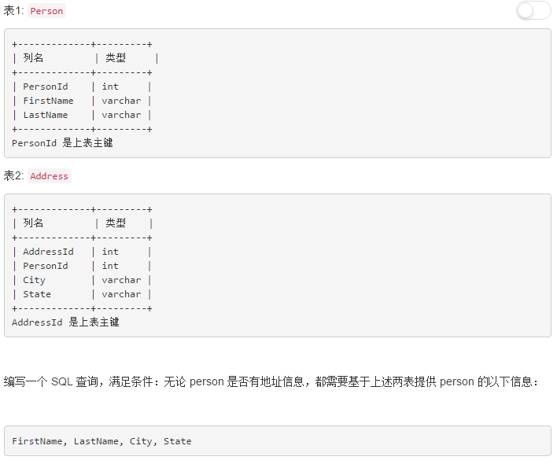

## 原理  
1.  什么是数据库事务?
    * 单个逻辑单元执行的一系列操作,这些操作要么全做要么全不做,是不可分割的.事务的开始和结束用户是可以控制的,如果没控制则由数据库默认的划分事务.事务具有以下性质:
    * 原子性(A)：指一个事务要么全执行,要么全不执行.也就是说一个事务不可能执行到一半就停止了.比如:你去买东西,钱付掉了,东西没拿.这两步必须同时执行 ,要么都不执行.
    * 一致性(C)：指事务的运行并不改变数据库中的一致性.比如 a+b=10;a改变了,b也应该随之改变.
        * 也就是说：如果事务是并发多个，系统也必须如同串行事务一样操作。其主要特征是保护性和不变性(Preserving an Invariant)，以转账案例为例，假设有五个账户，每个账户余额是100元，那么五个账户总额是500元，如果在这个5个账户之间同时发生多个转账，无论并发多少个，比如在A与B账户之间转账5元，在C与D账户之间转账10元，在B与E之间转账15元，五个账户总额也应该还是500元，这就是保护性和不变性。
    * 隔离性(I)：多个事务间的执行好像串行一样。两个以上的事务不会出现交替运行的状态,因为这样可能导致数据的不一致
    * 持久性(D): 事务运行成功之后数据库的更新是永久的,不会无缘无故的回滚.

2. 数据库事务隔离级别，脏读，幻读，不可重复读    

|	|脏读|	不可重复读|	幻读|    
|----|----|----|----|   
|Read uncommitted(读未提交)|	√|	√|	√|
|Read committed(读提交)|	×|	√|	√|
|Repeatable read(重复读)|	×|	×|	√|
|Serializable(序列化)	|   ×|  ×|  ×|  

   1. **脏读：**
      * 针对未提交数据
      * 脏读就是指当一个事务正在访问数据，并且对数据进行了修改，而这种修改还没有提交到数据库中，这时，另外一个事务也访问这个数据，然后使用了这个数据。
   2. **不可重复读：**   
      * 针对其他提交前后，读取数据本身的对比
      * 是指在一个事务内，多次读同一数据。在这个事务还没有结束时，另外一个事务也访问该同一数据。那么，在第一个事务中的两次读数据之间，由于第二个事务的修改，那么第一个事务两次读到的的数据可能是不一样的。这样就发生了在一个事务内两次读到的数据是不一样的，因此称为是不可重复读。（即不能读到相同的数据内容）
        例如，一个编辑人员两次读取同一文档，但在两次读取之间，作者重写了该文档。当编辑人员第二次读取文档时，文档已更改。原始读取不可重复。如果只有在作者全部完成编写后编辑人员才可以读取文档，则可以避免该问题。
   3. **幻读:**  
      * 针对其他提交前后，读取数据条数的对比
      * 是指当事务不是独立执行时发生的一种现象，例如第一个事务对一个表中的数据进行了修改，这种修改涉及到表中的全部数据行。同时，第二个事务也修改这个表中的数据，这种修改是向表中插入一行新数据。那么，以后就会发生操作第一个事务的用户发现表中还有没有修改的数据行，就好象
        发生了幻觉一样。 
        例如，一个编辑人员更改作者提交的文档，但当生产部门将其更改内容合并到该文档的主复本时，发现作者已将未编辑的新材料添加到该文档中。如果在编辑人员和生产部门完成对原始文档的处理之前，任何人都不能将新材料添加到文档中，则可以避免该问题。
   * Mysql的默认隔离级别就是Repeatable read   
   * [参考](https://blog.csdn.net/jiesa/article/details/51317164)
   * [参考](https://blog.csdn.net/yuxin6866/article/details/52649048)

3. 如果查询数据量大，如何加速读取？  
    1. 建立索引  
    2. 只查询指定的字段，不读取无用字段  
    3. 字段定义时合理的选择属性，尽量减少字段宽度  
    4. 如果结果在多个地方使用，不要多次查询，而应该一次性读取所有需要的数据。减少连接数据库的耗时。  
    5. 多进程处理加速    
4. 数据库范式  
    在关系型数据库中如何设计表结构，建立科学规范的数据库。这些规范就是范式。  
    三大范式只是一般设计数据库的基本理念，可以建立冗余较小、结构合理的数据库。如果有特殊情况，当然要特殊对待。
    **第一范式：** 
      * 所有字段值都是不可分解的原子值
      * 每一列属性都是不可再分的属性值，确保每一列的原子性
      * 两列的属性相近或相似或一样，尽量合并属性一样的列，确保不产生冗余数据。    
       
    **第二范式：**    
      * 每张表只做一件事，避免冗余信息   
      * 在一个数据库表中，一个表中只能保存一种数据，不可以把多种数据保存在同一张数据库表中。
      * 数据库表中不存在非关键字段对任一候选关键字段的部分函数依赖（部分函数依赖指的是存在组合关键字中的某些字段决定非关键字段的情况），也即所有非关键字段都完全依赖于任意一组候选关键字。 
      * 举例：   
         错误：SelectCourse(学号, 姓名, 年龄, 课程名称, 成绩, 学分)   
         原因：表对应组合关键字 (学号, 课程名称) → (姓名, 年龄, 成绩, 学分)
              但存在部分依赖关系  (课程名称) → (学分)   (学号) → (姓名, 年龄)
              应拆为三个表： 学生：Student(学号, 姓名, 年龄)；   
                            课程：Course(课程名称, 学分)；   
                            选课关系：SelectCourse(学号, 课程名称, 成绩)。  
               
    **第三范式：**  
      * 每一列数据都和主键直接相关，而不能间接相关  
      * 同一张表中的属性不能存在递进关系。数据不能存在传递关系，即没个属性都跟主键有直接关系而不是间接关系。像：a-->b-->c  属性之间含有这样的关系，是不符合第三范式的。  
      * 举例：
         错误：(学号) → (姓名, 年龄, 所在学院, 学院地点, 学院电话)   
         原因：存在递进关系 (学号) → (所在学院) → (学院地点, 学院电话)   
         应分为两个表：   
             学生：(学号, 姓名, 年龄, 所在学院)；   
             学院：(学院, 地点, 电话)。    
    **BCNF:** 
      * 候选关键字之间没有相互依赖关系   
      * 举例：  
        假设仓库管理关系表为StorehouseManage(仓库ID, 存储物品ID, 管理员ID, 数量)，且有一个管理员只在一个仓库工作；一个仓库可以存储多种物品。这个数据库表中存在如下决定关系：  
        (仓库ID, 存储物品ID) →(管理员ID, 数量)  
        (管理员ID, 存储物品ID) → (仓库ID, 数量)  
        所以，(仓库ID, 存储物品ID)和(管理员ID, 存储物品ID)都是StorehouseManage的候选关键字，表中的唯一非关键字段为数量，它是符合第三范式的。但是，由于存在如下决定关系：  
        (仓库ID) → (管理员ID)  
        (管理员ID) → (仓库ID)  
        即存在关键字段决定关键字段的情况，所以其不符合BCNF范式    
        仓库管理关系表应该分解为二个关系表：    
        仓库管理：StorehouseManage(仓库ID, 管理员ID)；  
        仓库：Storehouse(仓库ID, 存储物品ID, 数量)。  
      
    [参考](https://www.cnblogs.com/awidy/articles/3978724.html)  
    [参考](https://www.cnblogs.com/knowledgesea/p/3667395.html)

5. union 与union all的区别  
    union 在进行表链接后会筛选掉重复的记录，所以在表链接后会对所产生的结果集进行排 序运算，删除重复的记录再返回结果。 union all 则会显示重复结果,只是简单的两个结果合并并返回.所以效率比union高,在保证没有重复数据的情况下用union all.  

6. MySQL中myisam与innodb的区别  
    1. InnoDB支持事物，而MyISAM不支持事物
    2. InnoDB支持行级锁，而MyISAM支持表级锁
    3. InnoDB支持MVCC, 而MyISAM不支持
    4. InnoDB支持外键，而MyISAM不支持
    5. InnoDB不支持全文索引，而MyISAM支持。
    6. InnoDB不能通过直接拷贝表文件的方法拷贝表到另外一台机器， myisam 支持
    7. InnoDB表支持多种行格式， myisam 不支持
    8. InnoDB是索引组织表， myisam 是堆表   

7. 索引的实现方式   
    * 索引（Index）是帮助MySQL高效获取数据的数据结构。  
    * 主要采用b+树   
    * 树平衡，每个节点有若干个子节点，只有叶子节点存放数据，其他节点只存放主键值用于查找。  
    * 目的：加速查找速度。每个树节点对应一个磁盘块，一次读取一个磁盘块，查找下一个应该读取的磁盘块。由于树平衡所以读取任何数据的时间相同。由于有多个子节点，所以整体树的高度较小，磁盘IO数少。  
       
    [参考](https://blog.csdn.net/ifollowrivers/article/details/73614549)
8. MySQL中varchar与char的区别以及varchar(50)中的50代表的涵义  
    * char定长，varchar变长。如果存储的字节数少于char(n)，则在后面补空格。  
    * 长度超过n时，char,varchar相同  
    * varchar(n)表示最长存储长度  

9. MySQL中的各种join   
    [参考](https://www.cnblogs.com/BeginMan/p/3754322.html)   
    
10. MySQL中not in查询结果集中不能有null(实际工作遇到的问题)  
    * 如果数据集中的结果由null,则not in则查询结果为null; 
    [参考](https://blog.csdn.net/menghuanzhiming/article/details/77574135)

## SQL语句
1. 用一条 SQL  语句查询出每门课都大于 80 分的学生姓名
    * 都大于80,他的反面就是<=80,我们可以先求出所有<=80的姓名,然后取反就可以了 
    * select name from student where name not in (select  name from student where fenshu <=80);

2. leetcode 175  
   
   * 知识点：left join 获取包括所有左侧表中的结果，而不管右侧是否有结果  
```
SELECT FirstName, LastName, City, State 
FROM Person
LEFT JOIN Address 
ON Person.PersonId=Address.PersonId;
```

3. leetcode 176
   
```
select MAX(Salary) as SecondHighestSalary
From Employee
WHERE Salary not in (select MAX(Salary) as SecondHightestSalary
From Employee)
```
   
4. leetcode 178  
   
```
select s.Score Score, 
(select count(distinct Score) from Scores where Score >= s.Score) Rank
from Scores s
order by s.Score desc
```  
```
select Score, @rank := @rank + (@pre <> (@pre:=Score)) Rank
from Scores ,(SELECT @rank := 0,@pre:= -1) INIT
ORDER BY Score DESC
```  
上面语句的原理。先初始化了两个变量@rank和@pre, @rank是当前的排名，@pre是上一个记录的分数。  
@rank := @rank + (@pre <> (@pre:=Score)) 要分开看，
@pre:=Score，表示将Score赋值给@pre
@pre <> (@pre:=Score),表示如果之前的@pre值不等于当前的Score，则为1，否则为0  
@rank + (@pre <> (@pre:=Score))，表示如果之前的分数与当前分数相等，则@rank不变，否则@rank加1  

5. leetcode 180  
   
当成三张表来查  
```
select distinct a.Num as ConsecutiveNums 
from Logs a, Logs b, Logs c
where a.Id = b.Id + 1 and b.Id = c.Id + 1 and a.Num = b.Num and b.Num = c.Num; 
```

6. leetcode 181  
  
```
select a.Name as Employee
from Employee a 
inner join Employee b
on a.ManagerId=b.Id 
where a.Salary > b.Salary;
```
```
select A.Name as Employee
from Employee as A, Employee as B
where A.ManagerId = B.Id and A.Salary > B.Salary;
```   

7. leetcode 182  
   
注意having条件
```
select Email 
from Person
group by Email 
having count(*) > 1;
```

8. leetcode 183  
  
连接或者子查询  
```
select a.Name as Customers 
from Customers a  
left join Orders b
on a.Id=b.CustomerId
where b.CustomerId is null;
```
```
select c.Name as Customers
from customers c
where c.id not in (select CustomerId from Orders)
```   

9. leetcode 184 
   
对于条件复杂的查询，关键是找到辅助表
```
select d.Name as Department, e.Name as Employee, e.Salary
from Employee e, Department d,
(select max(Salary) ms, DepartmentId
from Employee
group by DepartmentId) t
where e.Salary=t.ms and e.DepartmentId=d.Id and d.Id=t.DepartmentId;
```


## 题目来源   
[来源1](https://blog.csdn.net/qq_33223299/article/details/77096587)  
[来源2](https://www.cnblogs.com/panwenbin-logs/p/8366940.html)  
